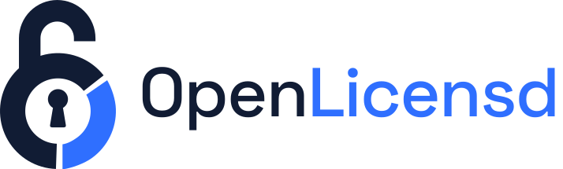
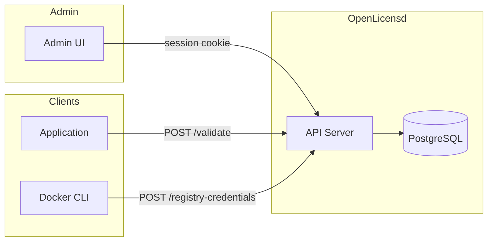

<div align="center">



<h3>Open source license server for creating and validating license keys</h3>

<sub><em>Self-hosted. Single binary. PostgreSQL-backed.</em></sub>

<br>

[](https://github.com/alvarorg14/openlicensd/actions/workflows/ci.yml)
[](https://github.com/alvarorg14/openlicensd/actions/workflows/sdk-ci.yml)
[](https://github.com/alvarorg14/openlicensd/actions/workflows/vuln.yml)
[](https://github.com/alvarorg14/openlicensd/actions/workflows/release.yml)
[](https://github.com/alvarorg14/openlicensd/releases)
[](https://github.com/alvarorg14/openlicensd/blob/main/LICENSE)
[](https://github.com/alvarorg14/openlicensd/pkgs/container/openlicensd)
[](https://github.com/alvarorg14/openlicensd/pkgs/container/charts%2Fopenlicensd)
[](https://github.com/alvarorg14/openlicensd/pulls)

<br>

[](https://go.dev/)
[](https://vuejs.org/)
[](https://nuxt.com/)
[](https://www.postgresql.org/)
[](https://helm.sh/)
[](https://www.docker.com/)

<br>

[Quick Start](#-quick-start) · [API](#-api) · [Configuration](#%EF%B8%8F-configuration) · [Contributing](#-contributing)

</div>

---

## 📋 Table of Contents

- [🔑 OpenLicensd](#-openlicensd)
  - [📋 Table of Contents](#-table-of-contents)
  - [📖 Overview](#-overview)
  - [🤔 Why OpenLicensd?](#-why-openlicensd)
  - [✨ Features](#-features)
  - [🚀 Quick Start](#-quick-start)
  - [📡 API](#-api)
  - [⚙️ Configuration](#️-configuration)
  - [🔧 How It Works](#-how-it-works)
  - [🐳 Harbor Registry Credentials](#-harbor-registry-credentials)
  - [🔐 OIDC SSO](#-oidc-sso)
  - [💻 Local Development](#-local-development)
  - [🤝 Contributing](#-contributing)
  - [🔒 Security](#-security)
  - [📄 License](#-license)

---

## 📖 Overview

**OpenLicensd** is a self-hosted license server for creating, managing, and validating license keys. It ships as a single Go binary with an embedded Nuxt admin UI and stores data in PostgreSQL.

Use it to gate access to your software, issue time-limited keys, track validation usage, and optionally provide short-lived Harbor registry credentials to licensed clients.

## 🤔 Why OpenLicensd?

- **Self-hosted** — no third-party license service dependency
- **Single binary** — API and admin UI in one deployable artifact
- **Simple API** — public validation endpoint for client applications
- **Harbor integration** — optional short-lived registry credentials for container image distribution
- **OIDC SSO** — optional single sign-on via any standards-compliant identity provider
- **Kubernetes-ready** — Helm chart with Ingress, External Secrets, and health probes

## ✨ Features

- Admin UI with sidebar navigation for licenses, products, and policies
- **Products** — scope licenses to an application (identified by a unique `code`)
- **Policies** — per-product expiration rules (duration, basis, grace period)
- License creation requires a product and policy; expiration is derived from the policy
- Optional manual expiration override per license
- Usage tracking (`last_validated_at` and `validation_count`)
- **Max activations** — limit concurrent machines per license key (policy default, per-license override)
- Machine activation tracking with admin release and rename
- Public validation endpoint with optional product scoping, machine fingerprint, and grace period support
- Human-readable Crockford Base32 key format (`XXXXX-XXXXX-XXXXX-XXXXX-XXXXX`)
- Optional Harbor registry credentials endpoint (short-lived robot accounts)
- Optional OIDC SSO for admin login (Google, Entra ID, Keycloak, Okta, GitLab, and other providers)
- Single binary distribution with embedded UI
- PostgreSQL storage with automatic migrations
- Helm chart for Kubernetes deployment

## 🚀 Quick Start

> **New here?** See [QUICKSTART.md](QUICKSTART.md) for a step-by-step get-running guide.

Container images are published to `ghcr.io/alvarorg14/openlicensd` on release (image tags: `X.Y.Z`, `X.Y`, `latest`; git tags: `vX.Y.Z`). The Helm chart is published to `oci://ghcr.io/alvarorg14/charts/openlicensd`.

```bash
helm install openlicensd oci://ghcr.io/alvarorg14/charts/openlicensd \
  --version X.Y.Z \
  --namespace openlicensd \
  --create-namespace
```

Try the published image with Docker Compose:

```bash
make stack-up
```

Open http://localhost:8080 and sign in with `admin@example.com` / `admin`.

For local development:

```bash
make dev-db
cp .env.example .env
make dev-server   # terminal 1
make dev-ui       # terminal 2
```

Open http://localhost:3000 and sign in with `admin` / `admin`.

## 📡 API

All endpoints are under `/api/v1`. The full specification is in [docs/openapi.yaml](docs/openapi.yaml).

| Method | Path | Auth | Description |
|--------|------|------|-------------|
| `POST` | `/api/v1/auth/login` | None | Admin login (sets session cookies) |
| `POST` | `/api/v1/validate` | None | Validate a license key |
| `POST` | `/api/v1/registry-credentials` | None | Issue Harbor credentials (when enabled) |
| `POST` | `/api/v1/products` | Session | Create a product |
| `GET` | `/api/v1/products` | Session | List products (paginated; supports `page`, `page_size`, `search`, `sort`, `order`) |
| `PATCH` | `/api/v1/products/{id}` | Session | Update a product |
| `DELETE` | `/api/v1/products/{id}` | Session | Delete a product |
| `POST` | `/api/v1/policies` | Session | Create a policy |
| `GET` | `/api/v1/policies` | Session | List policies (paginated; supports `product_id`, `search`, `sort`, `order`) |
| `PATCH` | `/api/v1/policies/{id}` | Session | Update a policy |
| `DELETE` | `/api/v1/policies/{id}` | Session | Delete a policy |
| `POST` | `/api/v1/licenses` | Session | Create a license |
| `GET` | `/api/v1/licenses` | Session | List licenses (paginated; supports `status`, `product_id`, `policy_id`, `search`, `sort`, `order`) |
| `GET` | `/api/v1/licenses/stats` | Session | License status counts (total, active, expired, revoked) |
| `GET` | `/api/v1/licenses/{id}` | Session | Get a license by ID |
| `PATCH` | `/api/v1/licenses/{id}` | Session | Update a license |
| `DELETE` | `/api/v1/licenses/{id}` | Session | Delete a license |
| `PATCH` | `/api/v1/licenses/{id}/revoke` | Session | Revoke a license |
| `PATCH` | `/api/v1/licenses/{id}/activate` | Session | Re-activate a license |
| `GET` | `/api/v1/licenses/{id}/machines` | Session | List machines that activated a license |
| `PATCH` | `/api/v1/licenses/{id}/machines/{machineId}` | Session | Rename a machine |
| `DELETE` | `/api/v1/licenses/{id}/machines/{machineId}` | Session | Release a machine (free a seat) |
| `GET` | `/api/v1/users` | Session (admin) | List users |
| `POST` | `/api/v1/users` | Session (admin) | Create a user |

See [docs/api.md](docs/api.md) for authentication flow and curl examples.

## Client SDKs

Official client libraries for integrating license validation into your applications:

| Language | Package | Docs |
|----------|---------|------|
| Go | [`github.com/alvarorg14/openlicensd/sdk/go`](https://pkg.go.dev/github.com/alvarorg14/openlicensd/sdk/go) | [docs/sdk/go.md](docs/sdk/go.md) |

```go
import openlicensd "github.com/alvarorg14/openlicensd/sdk/go"

fp, _ := openlicensd.Fingerprint("my-cli")
client, _ := openlicensd.New(
    "https://licenses.example.com",
    "acme-widget",
    openlicensd.WithFingerprint(fp),
)
result, _ := client.Validate(ctx, licenseKey)
```

## ⚙️ Configuration

| Variable | Default | Description |
|----------|---------|-------------|
| `OPENLICENSD_ADDR` | `:8080` | HTTP listen address |
| `OPENLICENSD_DATABASE_URL` | *(required)* | PostgreSQL connection URL |
| `OPENLICENSD_BOOTSTRAP_ADMIN_EMAIL` | — | Email for first admin (required on empty database) |
| `OPENLICENSD_BOOTSTRAP_ADMIN_PASSWORD_HASH` | — | Bcrypt hash for bootstrap admin password |
| `OPENLICENSD_SESSION_TTL_HOURS` | `24` | Session lifetime in hours |
| `OPENLICENSD_SESSION_CLEANUP_INTERVAL_MINUTES` | `60` | Interval for deleting expired/revoked sessions (`0` disables) |
| `OPENLICENSD_COOKIE_SECURE` | `true` | Set `Secure` flag on session cookies (`false` for local HTTP) |

Rate limiting and trusted-proxy variables (`OPENLICENSD_RATE_LIMIT_*`, `OPENLICENSD_TRUSTED_PROXIES`) are documented in [docs/configuration.md](docs/configuration.md). Harbor variables (`OPENLICENSD_HARBOR_*`) and OIDC SSO variables (`OPENLICENSD_OIDC_*`) are documented in [docs/configuration.md](docs/configuration.md). See [docs/oidc-sso.md](docs/oidc-sso.md) for provider setup walkthroughs.

Generate a password hash:

```bash
make hash-password PASSWORD=yourpassword
```

## 🔧 How It Works



1. Admins manage licenses through the embedded UI or the REST API.
2. Client applications validate license keys via the public `/validate` endpoint.
3. When Harbor integration is enabled, licensed clients can obtain short-lived registry credentials.
4. License keys are stored as SHA-256 hashes; only the key prefix is retained for display.

See [docs/architecture.md](docs/architecture.md) for component details and data flows.

## 🐳 Harbor Registry Credentials

When `OPENLICENSD_HARBOR_ENABLED=true`, licensed clients can exchange a valid license key for short-lived Harbor robot account credentials with pull access to configured projects.

```bash
curl -s -X POST https://licenses.example.com/api/v1/registry-credentials \
  -H "Content-Type: application/json" \
  -d '{"key":"X4F9K-7QP2M-3RH8N-BW6TG-YZ2CD"}'
```

See [docs/harbor-registry-credentials.md](docs/harbor-registry-credentials.md) for setup, configuration, and troubleshooting.

## 🔐 OIDC SSO

When `OPENLICENSD_OIDC_ENABLED=true`, admins can sign in through any standards-compliant OIDC identity provider (Google, Entra ID, Keycloak, Okta, GitLab, and others). Users are provisioned on first login; roles are managed locally in the admin UI.

Register this redirect URI with your IdP:

```
https://<your-host>/api/v1/auth/oidc/callback
```

See [docs/oidc-sso.md](docs/oidc-sso.md) for setup, configuration, and troubleshooting.

## 💻 Local Development

Requires Go 1.26+, Node.js 24+, and Docker (for local PostgreSQL).

Run `make help` to list all available targets:

```bash
make dev-db        # Start PostgreSQL
make dev-db-reset  # Reset dev PostgreSQL volume
make dev-server    # Run API server (loads .env)
make dev-ui        # Run Nuxt dev server
make stack-up      # Start Postgres + openlicensd from GHCR image
make stack-down    # Stop full stack (ARGS=-v to drop data)
make stack-logs    # Tail full stack logs
make build         # Build UI + binary
make test          # Run Go tests
make lint          # go vet + golangci-lint + ESLint (same as CI)
```

A plain `go build` embeds a placeholder admin page; run `make build` (or `make ui` first) for the full admin UI.

See [AGENTS.md](AGENTS.md) for architecture details and AI assistant guidelines.

## 🤝 Contributing

Contributions are welcome! Issues and pull requests help make this project better for everyone.

- See [ROADMAP.md](ROADMAP.md) for the path to v1.0 and open work
- Read [CONTRIBUTING.md](CONTRIBUTING.md) for the development workflow
- Follow our [Code of Conduct](CODE_OF_CONDUCT.md)
- See [AGENTS.md](AGENTS.md) if you're an AI assistant or want deeper architecture context

## 🔒 Security

If you discover a security vulnerability, please report it via a private GitHub security advisory. Do **not** open a public issue.

See [SECURITY.md](SECURITY.md) for the full security policy.

**Dependency maintenance:** Renovate opens pull requests for Go modules, npm packages, Docker base images, and GitHub Actions updates. Install the [Renovate GitHub App](https://github.com/apps/renovate) on this repository to enable it.

**Vulnerability scanning:** A separate Vulnerability Scan workflow runs govulncheck weekly, on demand, and on pull requests (non-blocking) to detect known vulnerabilities in Go dependencies.

## 📄 License

[](LICENSE)

Apache License 2.0 — see [LICENSE](LICENSE).

---

<sub>Made with ❤️ using Go, Vue, and PostgreSQL</sub>
