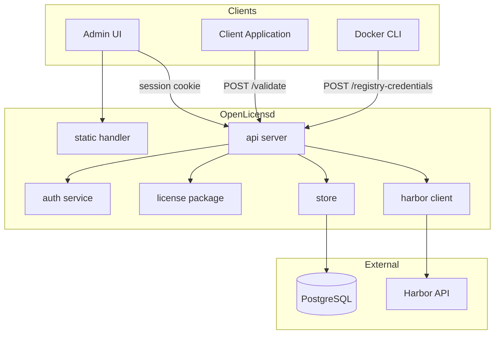
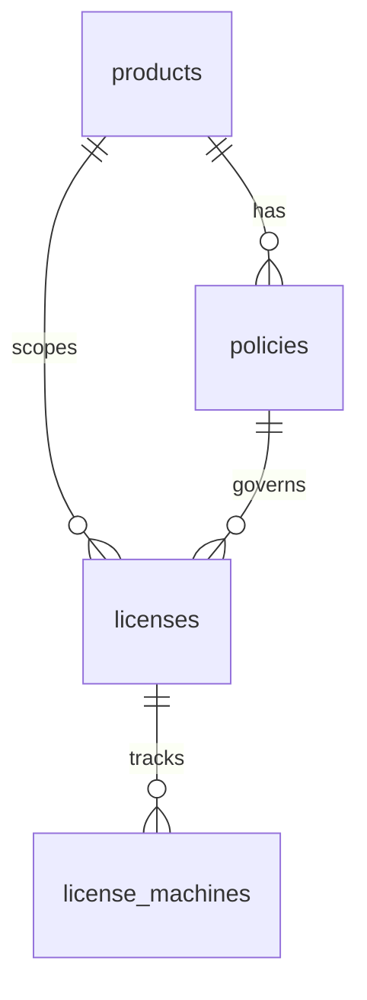
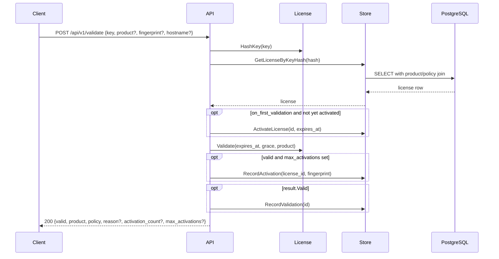
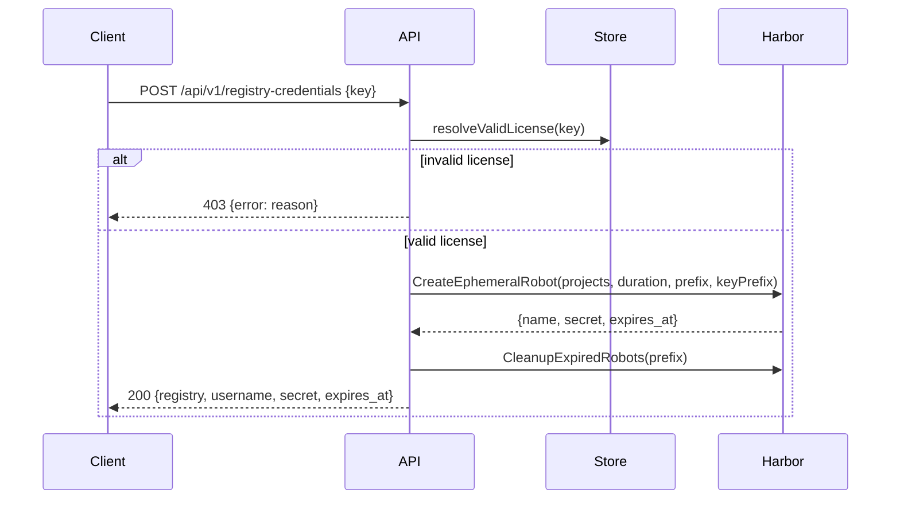
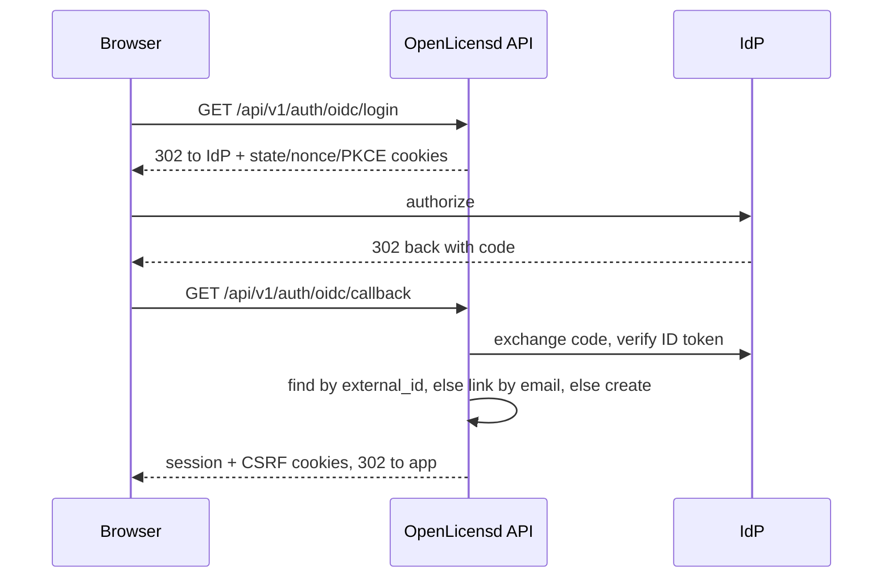

# Architecture

## Overview

OpenLicensd is a single-binary license server with an embedded admin UI. It exposes a REST API for license management and public validation, backed by PostgreSQL.



## Components

| Package | Path | Responsibility |
|---------|------|----------------|
| `api` | `server/internal/api/` | HTTP router, handlers, request/response types |
| `auth` | `server/internal/auth/` | Bcrypt login, session cookies, CSRF, Bearer API tokens, role middleware |
| `oidc` | `server/internal/oidc/` | OIDC discovery, PKCE flow, ID token verification |
| `config` | `server/internal/config/` | Environment variable loading and validation |
| `harbor` | `server/internal/harbor/` | Harbor v2 REST client for ephemeral robot accounts |
| `license` | `server/internal/license/` | Key generation (Crockford Base32), SHA-256 hashing, validation logic |
| `logging` | `server/internal/logging/` | Structured `slog` output, request-scoped loggers, HTTP request logging middleware |
| `ratelimit` | `server/internal/ratelimit/` | Per-IP token bucket rate limiting (`memory` or `postgres` backend) |
| `maintenance` | `server/internal/maintenance/` | Background tasks (expired session cleanup) |
| `store` | `server/internal/store/` | PostgreSQL CRUD, validation recording, migrations |
| `static` | `server/internal/static/` | Embedded Nuxt SPA file server with SPA fallback |

### Entry point

`server/cmd/openlicensd/main.go` loads configuration, connects to PostgreSQL, runs migrations, starts a background session cleanup task (when enabled), and starts the HTTP server with graceful shutdown.

Migrations are automatic, forward-only, and transactional. SQL files in `server/internal/store/migrations/` are embedded in the binary, applied once (recorded in `schema_migrations`), and serialized across concurrent startups with a PostgreSQL advisory lock. There is no down-migration path — rollback requires restoring a pre-upgrade database backup. See [upgrade.md](upgrade.md) for operator upgrade and rollback procedures.

For multi-replica deployments, sessions and OIDC state are shared via PostgreSQL and browser cookies — no session stickiness is required. Set `OPENLICENSD_RATE_LIMIT_BACKEND=postgres` when running more than one replica so rate limits are global. See [scaling.md](scaling.md).

### Admin UI

The UI is a Nuxt 4 SPA built from `ui/`:

```
ui/  →  npm run generate  →  server/internal/static/dist/  →  //go:embed
```

Git tracks a self-contained placeholder `index.html` so `go build` on a fresh clone serves a working page. Run `make ui` (or `make build`) locally, or rely on GoReleaser's pre-build hook, to embed the full Nuxt SPA.

In development, the UI runs on `:3000` and proxies `/api` to the Go server on `:8080`. In production, the built static files are embedded in the binary and served via the `NotFound` handler (SPA fallback to `200.html`). Lucide icons are bundled into the client at `nuxt generate` time (`@iconify-json/lucide` + `@nuxt/icon` client bundle) because the embedded UI's `Content-Security-Policy` does not allow runtime fetches to the Iconify API. All HTTP responses — including the embedded UI, API, and health probes — pass through security-header middleware that sets `Content-Security-Policy`, `X-Frame-Options`, and `X-Content-Type-Options`; `Strict-Transport-Security` is added when `OPENLICENSD_COOKIE_SECURE=true`. API requests are bounded by configurable per-request context deadlines (`OPENLICENSD_REQUEST_TIMEOUT_SECONDS`, default 30 seconds); `/readyz` additionally caps database pings at 2 seconds.

The admin UI has a left sidebar with pages for **Licenses**, **Products**, **Policies**, and **Users** (admin only). Admins can reset user passwords from the Users page.

## Data model



### `products` table

| Column | Type | Description |
|--------|------|-------------|
| `id` | `UUID` | Primary key |
| `name` | `TEXT` | Display name |
| `code` | `TEXT` | Unique machine identifier (sent by clients on validation) |
| `description` | `TEXT` | Optional description |
| `created_at` / `updated_at` | `TIMESTAMPTZ` | Timestamps |

### `policies` table

| Column | Type | Description |
|--------|------|-------------|
| `id` | `UUID` | Primary key |
| `product_id` | `UUID` | FK to `products` |
| `name` | `TEXT` | Policy name (unique per product) |
| `description` | `TEXT` | Optional description |
| `duration_days` | `INTEGER` | Null = perpetual |
| `expiration_basis` | `TEXT` | `on_creation` or `on_first_validation` |
| `grace_period_days` | `INTEGER` | Days after expiry when validation still succeeds |
| `max_activations` | `INTEGER` | Null = unlimited concurrent machine activations |
| `created_at` / `updated_at` | `TIMESTAMPTZ` | Timestamps |

### `licenses` table

| Column | Type | Description |
|--------|------|-------------|
| `id` | `UUID` | Primary key (auto-generated) |
| `label` | `TEXT` | Human-readable label |
| `key_hash` | `TEXT` | SHA-256 hash of the full license key (unique) |
| `key_prefix` | `TEXT` | First 5-character group (for display) |
| `product_id` | `UUID` | FK to `products` (required) |
| `policy_id` | `UUID` | FK to `policies` (required; composite FK ensures same product) |
| `expires_at` | `TIMESTAMPTZ` | Optional expiration (derived from policy or overridden) |
| `activated_at` | `TIMESTAMPTZ` | Set on first validation for `on_first_validation` policies |
| `revoked` | `BOOLEAN` | Whether the license is revoked |
| `created_at` | `TIMESTAMPTZ` | Creation timestamp |
| `last_validated_at` | `TIMESTAMPTZ` | Last successful validation lookup |
| `validation_count` | `BIGINT` | Successful validation count |
| `max_activations` | `INTEGER` | Snapshotted activation limit; null = unlimited |

### `license_machines` table

| Column | Type | Description |
|--------|------|-------------|
| `id` | `UUID` | Primary key |
| `license_id` | `UUID` | FK to `licenses` (cascade on delete) |
| `fingerprint` | `TEXT` | Client-supplied stable machine identifier (unique per license) |
| `name` | `TEXT` | Optional admin alias |
| `hostname` | `TEXT` | Optional client-supplied display hostname |
| `first_seen_at` | `TIMESTAMPTZ` | First activation time |
| `last_seen_at` | `TIMESTAMPTZ` | Last successful validation from this fingerprint |
| `last_seen_ip` | `TEXT` | Last client IP observed during validation |
| `validation_count` | `BIGINT` | Validations from this fingerprint |
| `deactivated_at` | `TIMESTAMPTZ` | Set when an operator releases the machine |
| `deactivated_by` | `UUID` | FK to `users`; operator who released the machine |

### `api_tokens` table

| Column | Type | Description |
|--------|------|-------------|
| `id` | `UUID` | Primary key |
| `name` | `TEXT` | Unique display name (case-insensitive) |
| `token_hash` | `TEXT` | SHA-256 hash of the full bearer token (unique) |
| `token_prefix` | `TEXT` | Display prefix (`olsd_` + first 8 hex chars) |
| `role` | `TEXT` | `admin`, `operator`, or `viewer` |
| `created_by` | `UUID` | Nullable FK to `users` (audit reference; `ON DELETE SET NULL`) |
| `last_used_at` | `TIMESTAMPTZ` | Last authenticated request (throttled writes) |
| `expires_at` | `TIMESTAMPTZ` | Optional expiration |
| `revoked_at` | `TIMESTAMPTZ` | Set on revocation (soft revoke; row retained in lists) |
| `created_at` / `updated_at` | `TIMESTAMPTZ` | Timestamps |

Only the SHA-256 hash of the API token is stored.

### Expiry semantics

- Policy rules are **snapshotted** onto the license at issuance; editing a policy does not change existing licenses.
- `on_creation`: `expires_at` is set when the license is created.
- `on_first_validation`: `expires_at` and `activated_at` are set on the first validation.
- `grace_period_days` allows validation to succeed briefly after `expires_at` (response includes `in_grace_period: true`).

## License key format

New keys are generated in a human-readable grouped format using Crockford Base32:

```
XXXXX-XXXXX-XXXXX-XXXXX-XXXXX
```

Example: `X4F9K-7QP2M-3RH8N-BW6TG-YZ2CD`

- 5 groups of 5 characters, separated by dashes
- Charset: `0-9`, `A-Z` excluding ambiguous characters (`I`, `L`, `O`, `U`)
- ~125 bits of entropy
- Only the first group is stored as `key_prefix` for display

## Request flows

### License validation



Validation always returns HTTP 200. When validation succeeds (`valid: true`), `last_validated_at` and `validation_count` are updated. Failed lookups (not found, revoked, expired, product mismatch, fingerprint required, activation limit) do not increment usage. Activation limits count **distinct machine fingerprints**, not validation events. When a license has `max_activations`, clients must send a `fingerprint` or receive `fingerprint_required`. New fingerprints beyond the limit receive `activation_limit`.

### Harbor registry credentials



See [harbor-registry-credentials.md](harbor-registry-credentials.md) for full details.

### OIDC SSO



OIDC authenticates users but does not authorize them: roles remain local and are managed in the Users UI. See [oidc-sso.md](oidc-sso.md) for provider setup.

## HTTP routing

| Method | Path | Auth | Notes |
|--------|------|------|-------|
| `GET` | `/healthz` | None | Liveness (no dependency checks) |
| `GET` | `/readyz` | None | Readiness (PostgreSQL ping, 2s timeout) |
| `POST` | `/api/v1/auth/login` | None | Sets session cookies (when local login enabled) |
| `GET` | `/api/v1/auth/providers` | None | List enabled login methods |
| `GET` | `/api/v1/auth/oidc/login` | None | Start OIDC login (when enabled) |
| `GET` | `/api/v1/auth/oidc/callback` | None | OIDC callback (when enabled) |
| `POST` | `/api/v1/validate` | None | Public validation |
| `POST` | `/api/v1/registry-credentials` | None | Only when Harbor enabled |
| `POST` | `/api/v1/products` | Session | Create product |
| `GET` | `/api/v1/products` | Session | List products (paginated) |
| `PATCH` | `/api/v1/products/{id}` | Session | Update product |
| `DELETE` | `/api/v1/products/{id}` | Session | Delete product |
| `POST` | `/api/v1/policies` | Session | Create policy |
| `GET` | `/api/v1/policies` | Session | List policies (paginated; `?product_id=` filter) |
| `PATCH` | `/api/v1/policies/{id}` | Session | Update policy |
| `DELETE` | `/api/v1/policies/{id}` | Session | Delete policy |
| `POST` | `/api/v1/licenses` | Session | Create license |
| `GET` | `/api/v1/licenses` | Session | List licenses (paginated) |
| `GET` | `/api/v1/licenses/stats` | Session | License status counts |
| `GET` | `/api/v1/licenses/{id}` | Session | Get license by ID |
| `PATCH` | `/api/v1/licenses/{id}` | Session | Update license |
| `DELETE` | `/api/v1/licenses/{id}` | Session | Delete license |
| `PATCH` | `/api/v1/licenses/{id}/revoke` | Session | Revoke license |
| `PATCH` | `/api/v1/licenses/{id}/unrevoke` | Session | Unrevoke license |
| `GET` | `/api/v1/users` | Session or Bearer (admin) | List users (paginated) |
| `GET` | `/api/v1/api-tokens` | Session (admin) | List API tokens (paginated) |
| `POST` | `/api/v1/api-tokens` | Session (admin) | Create API token (raw value returned once) |
| `PATCH` | `/api/v1/api-tokens/{id}/revoke` | Session (admin) | Revoke API token |
| `DELETE` | `/api/v1/api-tokens/{id}` | Session (admin) | Delete API token |
| `*` | All other paths | None | Embedded SPA |

## Related

- [api.md](api.md) — API usage and curl examples
- [openapi.yaml](openapi.yaml) — full OpenAPI specification
- [configuration.md](configuration.md) — environment variables
- [AGENTS.md](../AGENTS.md) — development guidelines
