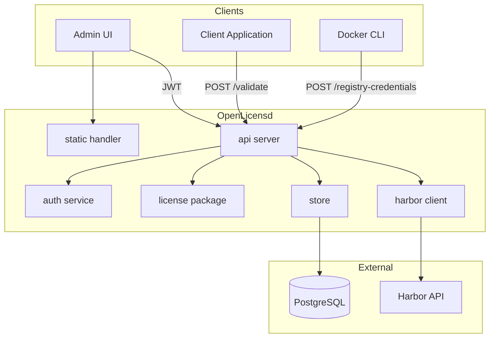
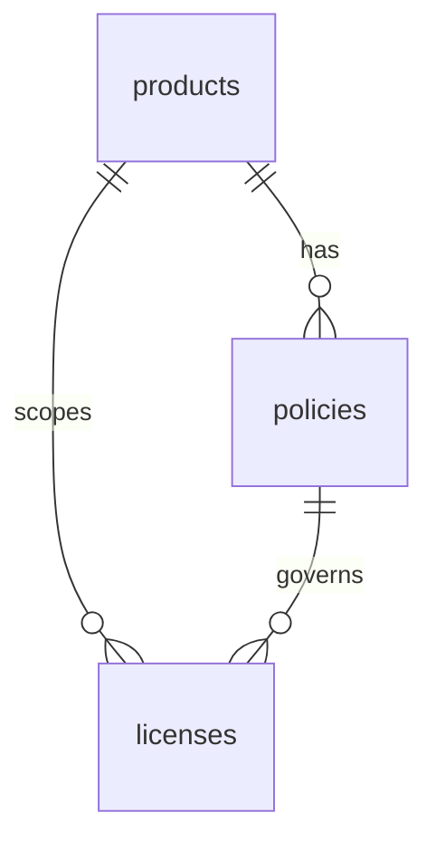
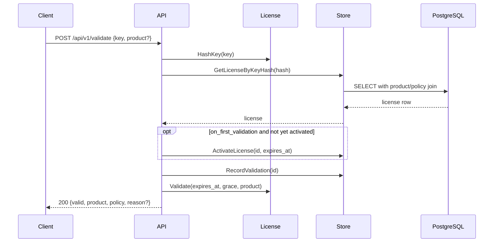
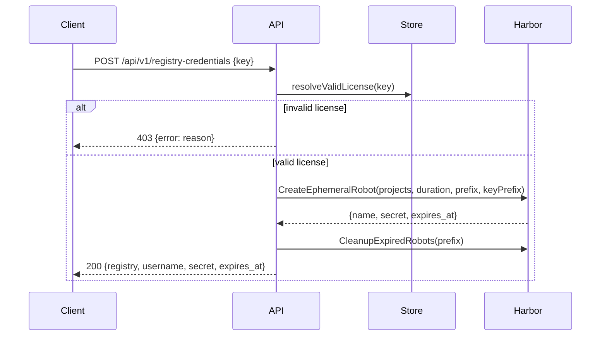

# Architecture

## Overview

OpenLicensd is a single-binary license server with an embedded admin UI. It exposes a REST API for license management and public validation, backed by PostgreSQL.



## Components

| Package | Path | Responsibility |
|---------|------|----------------|
| `api` | `server/internal/api/` | HTTP router, handlers, request/response types |
| `auth` | `server/internal/auth/` | Bcrypt login, HS256 JWT signing, bearer middleware |
| `config` | `server/internal/config/` | Environment variable loading and validation |
| `harbor` | `server/internal/harbor/` | Harbor v2 REST client for ephemeral robot accounts |
| `license` | `server/internal/license/` | Key generation (Crockford Base32), SHA-256 hashing, validation logic |
| `store` | `server/internal/store/` | PostgreSQL CRUD, validation recording, migrations |
| `static` | `server/internal/static/` | Embedded Nuxt SPA file server with SPA fallback |

### Entry point

`server/cmd/openlicensd/main.go` loads configuration, connects to PostgreSQL, runs migrations, and starts the HTTP server with graceful shutdown.

### Admin UI

The UI is a Nuxt 4 SPA built from `ui/`:

```
ui/  →  npm run generate  →  server/internal/static/dist/  →  //go:embed
```

In development, the UI runs on `:3000` and proxies `/api` to the Go server on `:8080`. In production, the built static files are embedded in the binary and served via the `NotFound` handler (SPA fallback to `200.html`).

The admin UI has a left sidebar with pages for **Licenses**, **Products**, and **Policies**.

## Data model



### `products` table

| Column | Type | Description |
|--------|------|-------------|
| `id` | `UUID` | Primary key |
| `name` | `TEXT` | Display name |
| `code` | `TEXT` | Unique machine identifier (sent by clients on validation) |
| `description` | `TEXT` | Optional description |
| `archived_at` | `TIMESTAMPTZ` | Soft-delete marker (reserved) |
| `created_at` / `updated_at` | `TIMESTAMPTZ` | Timestamps |

### `policies` table

| Column | Type | Description |
|--------|------|-------------|
| `id` | `UUID` | Primary key |
| `product_id` | `UUID` | FK to `products` |
| `name` | `TEXT` | Policy name (unique per product) |
| `description` | `TEXT` | Optional description |
| `duration_days` | `INTEGER` | Null = perpetual |
| `expiration_basis` | `TEXT` | `on_creation` or `on_first_validation` |
| `grace_period_days` | `INTEGER` | Days after expiry when validation still succeeds |
| `archived_at` | `TIMESTAMPTZ` | Soft-delete marker (reserved) |
| `created_at` / `updated_at` | `TIMESTAMPTZ` | Timestamps |

### `licenses` table

| Column | Type | Description |
|--------|------|-------------|
| `id` | `UUID` | Primary key (auto-generated) |
| `label` | `TEXT` | Human-readable label |
| `key_hash` | `TEXT` | SHA-256 hash of the full license key (unique) |
| `key_prefix` | `TEXT` | First 5-character group (for display) |
| `product_id` | `UUID` | FK to `products` (required) |
| `policy_id` | `UUID` | FK to `policies` (required; composite FK ensures same product) |
| `expires_at` | `TIMESTAMPTZ` | Optional expiration (derived from policy or overridden) |
| `activated_at` | `TIMESTAMPTZ` | Set on first validation for `on_first_validation` policies |
| `revoked` | `BOOLEAN` | Whether the license is revoked |
| `created_at` | `TIMESTAMPTZ` | Creation timestamp |
| `last_validated_at` | `TIMESTAMPTZ` | Last successful validation lookup |
| `validation_count` | `BIGINT` | Total validation count |

Only the SHA-256 hash of the license key is stored. The full key is shown once at creation and cannot be recovered.

### Expiry semantics

- Policy rules are **snapshotted** onto the license at issuance; editing a policy does not change existing licenses.
- `on_creation`: `expires_at` is set when the license is created.
- `on_first_validation`: `expires_at` and `activated_at` are set on the first validation.
- `grace_period_days` allows validation to succeed briefly after `expires_at` (response includes `in_grace_period: true`).

## License key format

New keys are generated in a human-readable grouped format using Crockford Base32:

```
XXXXX-XXXXX-XXXXX-XXXXX-XXXXX
```

Example: `X4F9K-7QP2M-3RH8N-BW6TG-YZ2CD`

- 5 groups of 5 characters, separated by dashes
- Charset: `0-9`, `A-Z` excluding ambiguous characters (`I`, `L`, `O`, `U`)
- ~125 bits of entropy
- Only the first group is stored as `key_prefix` for display

## Request flows

### License validation



Validation always returns HTTP 200. When the key is found (even if expired or revoked), `last_validated_at` and `validation_count` are updated.

### Harbor registry credentials



See [harbor-registry-credentials.md](harbor-registry-credentials.md) for full details.

## HTTP routing

| Method | Path | Auth | Notes |
|--------|------|------|-------|
| `GET` | `/healthz` | None | Liveness |
| `GET` | `/readyz` | None | Readiness (DB ping) |
| `POST` | `/api/v1/auth/login` | None | Returns JWT |
| `POST` | `/api/v1/validate` | None | Public validation |
| `POST` | `/api/v1/registry-credentials` | None | Only when Harbor enabled |
| `POST` | `/api/v1/products` | JWT | Create product |
| `GET` | `/api/v1/products` | JWT | List products |
| `PATCH` | `/api/v1/products/{id}` | JWT | Update product |
| `DELETE` | `/api/v1/products/{id}` | JWT | Delete product |
| `POST` | `/api/v1/policies` | JWT | Create policy |
| `GET` | `/api/v1/policies` | JWT | List policies (`?product_id=` filter) |
| `PATCH` | `/api/v1/policies/{id}` | JWT | Update policy |
| `DELETE` | `/api/v1/policies/{id}` | JWT | Delete policy |
| `POST` | `/api/v1/licenses` | JWT | Create license |
| `GET` | `/api/v1/licenses` | JWT | List licenses |
| `PATCH` | `/api/v1/licenses/{id}` | JWT | Update license |
| `DELETE` | `/api/v1/licenses/{id}` | JWT | Delete license |
| `PATCH` | `/api/v1/licenses/{id}/revoke` | JWT | Revoke license |
| `PATCH` | `/api/v1/licenses/{id}/activate` | JWT | Re-activate license |
| `*` | All other paths | None | Embedded SPA |

## Related

- [api.md](api.md) — API usage and curl examples
- [openapi.yaml](openapi.yaml) — full OpenAPI specification
- [configuration.md](configuration.md) — environment variables
- [AGENTS.md](../AGENTS.md) — development guidelines
