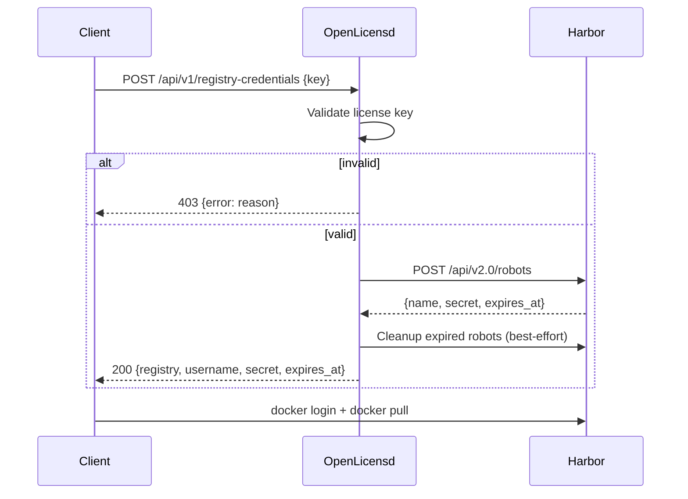

# Harbor Registry Credentials

OpenLicensd can issue short-lived Harbor robot account credentials in exchange for a valid license key. This lets licensed clients pull container images from a private Harbor registry without storing long-lived credentials.

## How it works



1. A client sends a license key to `POST /api/v1/registry-credentials`.
2. OpenLicensd validates the key (same logic as `/validate`, but returns HTTP 403 on failure).
3. If valid, OpenLicensd creates a short-lived Harbor robot account with pull access to the configured projects.
4. Expired robots created by OpenLicensd are cleaned up (best-effort, errors are logged but not returned).
5. The client uses the returned credentials with `docker login`.

## Prerequisites

### Harbor setup

1. A running Harbor instance with API v2.0.
2. A Harbor admin account (or an account with permission to create robot accounts).
3. One or more Harbor project namespaces that licensed clients should be able to pull from.

### OpenLicensd configuration

Enable Harbor and set the required variables:

```bash
OPENLICENSD_HARBOR_ENABLED=true
OPENLICENSD_HARBOR_URL=https://harbor.example.com
OPENLICENSD_HARBOR_ADMIN_USERNAME=admin
OPENLICENSD_HARBOR_ADMIN_PASSWORD=your-harbor-admin-password
OPENLICENSD_HARBOR_PROJECTS=myproject
```

When `OPENLICENSD_HARBOR_ENABLED=false` (the default), the `/api/v1/registry-credentials` route is not registered.

## Robot account details

### API call

OpenLicensd creates robots via `POST {HARBOR_URL}/api/v2.0/robots` with Basic auth (Harbor admin credentials).

Request payload:

```json
{
  "name": "openlicensd-x4f9k-1730284800000000000",
  "description": "ephemeral robot created by openlicensd",
  "level": "project",
  "duration": 1,
  "permissions": [
    {
      "kind": "project",
      "namespace": "myproject",
      "access": [
        { "resource": "repository", "action": "pull" }
      ]
    }
  ]
}
```

- **level**: `"project"` for a single project, `"system"` when multiple projects are configured.
- **duration**: Robot lifetime in days (from `OPENLICENSD_HARBOR_ROBOT_DURATION_DAYS`, default `1`).
- **permissions**: Pull-only access (`repository:pull`) per configured project.

### Naming

Robot names follow the pattern:

```
{prefix}-{keyPrefix}-{unixNano}
```

- `prefix`: from `OPENLICENSD_HARBOR_ROBOT_NAME_PREFIX` (default `openlicensd`)
- `keyPrefix`: the first 5-character group of the license key (e.g. `x4f9k`)
- `unixNano`: current time in nanoseconds (ensures uniqueness)

Non-alphanumeric characters are stripped; the result is lowercased. Example: `openlicensd-x4f9k-1730284800000000000`.

Harbor may prepend a project scope to the name in responses (e.g. `robot$myproject+openlicensd-x4f9k-123`).

### Cleanup

After each successful credential issuance, OpenLicensd lists all robots and deletes expired ones whose name contains the configured prefix. Cleanup failures are logged but do not affect the client response.

## Configuration reference

| Variable | Default | Description |
|----------|---------|-------------|
| `OPENLICENSD_HARBOR_ENABLED` | `false` | Enable the registry credentials endpoint |
| `OPENLICENSD_HARBOR_URL` | — | Harbor base URL (required when enabled) |
| `OPENLICENSD_HARBOR_ADMIN_USERNAME` | — | Harbor admin username |
| `OPENLICENSD_HARBOR_ADMIN_PASSWORD` | — | Harbor admin password |
| `OPENLICENSD_HARBOR_PROJECTS` | — | Comma-separated project namespaces |
| `OPENLICENSD_HARBOR_ROBOT_DURATION_DAYS` | `1` | Robot lifetime in days (minimum `1`) |
| `OPENLICENSD_HARBOR_ROBOT_NAME_PREFIX` | `openlicensd` | Robot name prefix |
| `OPENLICENSD_HARBOR_INSECURE_SKIP_VERIFY` | `false` | Skip TLS verification (self-signed certs) |
| `OPENLICENSD_HARBOR_DEBUG` | `false` | Log API requests/responses; append Harbor errors to `502` responses |

### Helm values

```yaml
config:
  harbor:
    enabled: true
    url: https://harbor.example.com
    projects: myproject,another-project
    robotDurationDays: 1
    robotNamePrefix: openlicensd
    insecureSkipVerify: false
    debug: false

secret:
  data:
    harborAdminUsername: admin
    harborAdminPassword: your-harbor-admin-password
```

## Client usage

### Request credentials

```bash
curl -s -X POST https://licenses.example.com/api/v1/registry-credentials \
  -H "Content-Type: application/json" \
  -d '{"key":"X4F9K-7QP2M-3RH8N-BW6TG-YZ2CD"}'
```

Success response:

```json
{
  "registry": "harbor.example.com",
  "username": "robot$myproject+openlicensd-x4f9k-123",
  "secret": "robot-secret",
  "expires_at": 1767225600
}
```

### Docker login and pull

```bash
echo "robot-secret" | docker login harbor.example.com \
  -u "robot\$myproject+openlicensd-x4f9k-123" \
  --password-stdin

docker pull harbor.example.com/myproject/myimage:latest
```

`expires_at` is a Unix timestamp indicating when the robot credentials expire.

## Error responses

| Status | `error` value | Cause |
|--------|---------------|-------|
| `400` | `invalid request body` / `key is required` | Malformed request |
| `403` | `not_found` | License key not found |
| `403` | `expired` | License has expired |
| `403` | `revoked` | License has been revoked |
| `502` | `failed to issue registry credentials` | Harbor API failure |
| `500` | `failed to validate license` | Database error |

When `OPENLICENSD_HARBOR_DEBUG=true`, `502` responses include the underlying Harbor error message.

## Troubleshooting

### `403` with `not_found`, `expired`, or `revoked`

The license key is invalid. Verify the key is correct, not expired, and not revoked in the admin UI.

### `502 failed to issue registry credentials`

Harbor rejected the robot creation request. Common causes:

- Harbor admin credentials are incorrect.
- The configured project namespace does not exist in Harbor.
- The admin account lacks permission to create robot accounts.
- Harbor is unreachable from the OpenLicensd pod.

Enable debug logging to see the full Harbor API request and response:

```bash
OPENLICENSD_HARBOR_DEBUG=true
```

Harbor secrets are redacted in logs (`"secret": "[REDACTED]"`).

### Self-signed Harbor certificates

For Harbor instances with self-signed TLS certificates:

```bash
OPENLICENSD_HARBOR_INSECURE_SKIP_VERIFY=true
```

> **Warning:** This disables TLS certificate verification. Use only in development or with trusted internal networks.

### Route returns 404

The `/api/v1/registry-credentials` endpoint is only registered when `OPENLICENSD_HARBOR_ENABLED=true`. Verify the environment variable is set and the server was restarted.

### Robots accumulating in Harbor

Expired robot cleanup runs on each successful credential request. If cleanup fails (e.g. Harbor admin lacks delete permission), robots may accumulate. Check OpenLicensd logs for `harbor cleanup failed` messages.

## Security considerations

- Harbor admin credentials are the highest-value secret in a Harbor-enabled deployment. Store them in a secrets manager (Kubernetes Secret, External Secrets Operator, etc.).
- Robot accounts have pull-only access to the configured projects.
- Credentials are short-lived (default 1 day).
- The `/registry-credentials` endpoint is public and unauthenticated — anyone with a valid license key can obtain credentials. There is no rate limiting.
- License keys are validated by SHA-256 hash lookup; the full key is never stored.

## Related

- [configuration.md](configuration.md) — all environment variables
- [api.md](api.md) — API usage and curl examples
- [openapi.yaml](openapi.yaml) — OpenAPI specification
