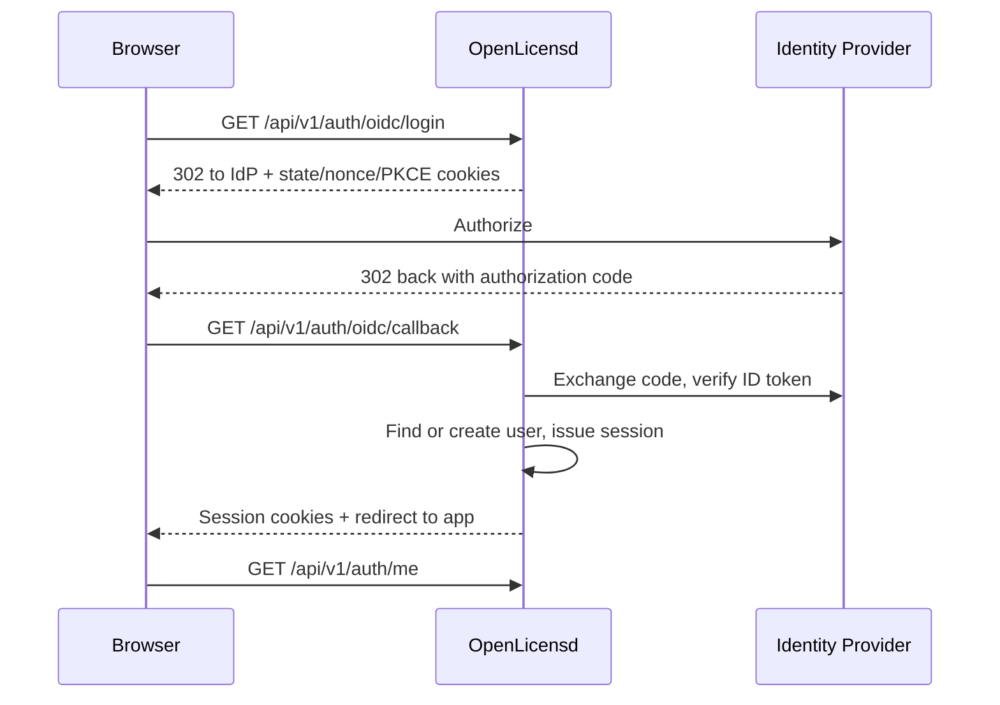

# OIDC Single Sign-On (SSO)

OpenLicensd supports generic OpenID Connect (OIDC) SSO alongside local email/password login. OIDC handles **authentication** (who you are); **authorization** (what you can do) stays in OpenLicensd — roles are assigned locally and are not synced from your identity provider.

## How it works



1. The user clicks **Sign in with SSO** on the login page (or navigates to `/api/v1/auth/oidc/login`).
2. OpenLicensd redirects to your OIDC provider with PKCE, `state`, and `nonce`.
3. After the user authenticates, the provider redirects back to `/api/v1/auth/oidc/callback`.
4. OpenLicensd exchanges the code, verifies the ID token, provisions or links the user, and sets the same session cookies used by local login (`openlicensd_session` + `openlicensd_csrf`).
5. The admin UI works identically regardless of how the user signed in.

## Redirect URI (most common misconfiguration)

Register this **exact** redirect URI in your identity provider:

```text
https://<your-host>/api/v1/auth/oidc/callback
```

It must match `OPENLICENSD_OIDC_REDIRECT_URL` byte for byte — including scheme (`https`), host, port, path, and trailing slash (or lack thereof).

Examples:

| Deployment | Redirect URI |
|------------|--------------|
| Local dev | `http://localhost:8080/api/v1/auth/oidc/callback` |
| Production | `https://licenses.example.com/api/v1/auth/oidc/callback` |

## Configuration reference

| Variable | Default | Required when OIDC enabled | Description |
|----------|---------|--------------------------|-------------|
| `OPENLICENSD_OIDC_ENABLED` | `false` | — | Enable OIDC SSO |
| `OPENLICENSD_OIDC_ISSUER_URL` | — | Yes | OIDC issuer URL (discovery endpoint base) |
| `OPENLICENSD_OIDC_CLIENT_ID` | — | Yes | OAuth 2.0 client ID |
| `OPENLICENSD_OIDC_CLIENT_SECRET` | — | Yes | OAuth 2.0 client secret |
| `OPENLICENSD_OIDC_REDIRECT_URL` | — | Yes | Callback URL registered with the IdP |
| `OPENLICENSD_OIDC_SCOPES` | `openid,profile,email` | No | Comma-separated scopes |
| `OPENLICENSD_OIDC_DEFAULT_ROLE` | `viewer` | No | Role for newly provisioned users (`admin`, `operator`, or `viewer`) |
| `OPENLICENSD_OIDC_PROVIDER_NAME` | `SSO` | No | Button label on the login page |
| `OPENLICENSD_OIDC_ADMIN_EMAILS` | — | No | Comma-separated emails that receive `admin` on **first** SSO login |
| `OPENLICENSD_LOCAL_LOGIN_ENABLED` | `true` | No | Allow email/password login (`false` for SSO-only) |

At least one of `OPENLICENSD_OIDC_ENABLED` or `OPENLICENSD_LOCAL_LOGIN_ENABLED` must be true.

### Minimal example

```bash
OPENLICENSD_OIDC_ENABLED=true
OPENLICENSD_OIDC_ISSUER_URL=https://accounts.google.com
OPENLICENSD_OIDC_CLIENT_ID=your-client-id.apps.googleusercontent.com
OPENLICENSD_OIDC_CLIENT_SECRET=your-client-secret
OPENLICENSD_OIDC_REDIRECT_URL=https://licenses.example.com/api/v1/auth/oidc/callback
OPENLICENSD_OIDC_DEFAULT_ROLE=viewer
OPENLICENSD_OIDC_PROVIDER_NAME=Google
OPENLICENSD_OIDC_ADMIN_EMAILS=admin@example.com
```

## User provisioning and roles

On each successful SSO login, OpenLicensd resolves the user in this order:

1. **Existing SSO user** — match by `(auth_provider=oidc, external_id=<sub claim>)`.
2. **Link by email** — if a user with the same email already exists (e.g. a local bootstrap admin), link the account by setting `auth_provider` and `external_id`. The existing password hash is preserved so local login still works when enabled.
3. **Create** — new user with `password_hash = NULL`, default role, and `auth_provider = oidc`.

**Roles are managed locally.** New users get `OPENLICENSD_OIDC_DEFAULT_ROLE` unless their email is listed in `OPENLICENSD_OIDC_ADMIN_EMAILS` (admin at creation time only). Admins can change roles in the **Users** page; changes persist across logins.

**SSO-only bootstrap:** set `OPENLICENSD_LOCAL_LOGIN_ENABLED=false`, enable OIDC, and list initial admin emails in `OPENLICENSD_OIDC_ADMIN_EMAILS`. Those users receive `admin` on first login.

**Disabling users:** a disabled user cannot sign in via SSO or local login. All their sessions are revoked when disabled.

## Provider setup walkthroughs

Verify console steps against your provider's current documentation — UIs change frequently.

### Google Workspace / Google Cloud

**Issuer URL:** `https://accounts.google.com`

1. Open [Google Cloud Console](https://console.cloud.google.com/) → **APIs & Services** → **OAuth consent screen**. Configure the consent screen (Internal for Workspace, External for testing).
2. Go to **Credentials** → **Create credentials** → **OAuth client ID**.
3. Application type: **Web application**.
4. **Authorized redirect URIs:** add `https://<your-host>/api/v1/auth/oidc/callback`.
5. Copy the **Client ID** and **Client secret** into your OpenLicensd configuration.
6. Scopes: `openid`, `profile`, and `email` are requested by default.

Google does not expose group membership in standard OIDC claims, so OpenLicensd manages roles locally.

### Microsoft Entra ID (Azure AD)

**Issuer URL:** `https://login.microsoftonline.com/<tenant-id>/v2.0`

1. Open [Microsoft Entra admin center](https://entra.microsoft.com/) → **Applications** → **App registrations** → **New registration**.
2. Name the app, select supported account types, and set **Redirect URI** to **Web** with `https://<your-host>/api/v1/auth/oidc/callback`.
3. After creation, copy the **Application (client) ID** and **Directory (tenant) ID**.
4. Go to **Certificates & secrets** → **New client secret**. Copy the secret value.
5. Under **Token configuration**, ensure `email` is available (often included by default with `openid profile email` scopes).

### Keycloak

**Issuer URL:** `https://<keycloak-host>/realms/<realm>`

1. Open your realm → **Clients** → **Create client**.
2. Client type: **OpenID Connect**. Client ID: e.g. `openlicensd`.
3. Enable **Client authentication** (confidential client).
4. Valid redirect URIs: `https://<your-host>/api/v1/auth/oidc/callback`.
5. Copy the client secret from the **Credentials** tab.
6. Ensure the client has `openid`, `profile`, and `email` scopes (default realm scopes usually include these).

### Okta

**Issuer URL:** `https://<your-org>.okta.com/oauth2/default` (or your custom authorization server)

1. Open Okta Admin → **Applications** → **Create App Integration**.
2. Sign-in method: **OIDC**, Application type: **Web Application**.
3. Sign-in redirect URI: `https://<your-host>/api/v1/auth/oidc/callback`.
4. Copy **Client ID** and **Client secret**.
5. Assign users or groups who should access OpenLicensd.

### GitLab

**Issuer URL:** `https://gitlab.com` (or your self-managed GitLab URL)

1. Open **User Settings** → **Applications** (for personal) or **Admin** → **Applications** (instance-wide).
2. Add a new application with redirect URI `https://<your-host>/api/v1/auth/oidc/callback`.
3. Scopes: `openid`, `profile`, `email`.
4. Copy **Application ID** (client ID) and **Secret**.

## Kubernetes / Helm

Add OIDC settings under `config.oidc` in `values.yaml` and store the client secret in the chart Secret:

```yaml
config:
  oidc:
    enabled: true
    issuerUrl: "https://login.microsoftonline.com/<tenant-id>/v2.0"
    clientId: "your-client-id"
    redirectUrl: "https://licenses.example.com/api/v1/auth/oidc/callback"
    defaultRole: viewer
    providerName: "Microsoft"
    adminEmails: "admin@example.com"

secret:
  data:
    oidcClientSecret: "your-client-secret"
```

For `secret.mode: existing` or `externalSecrets`, ensure the Secret contains `OPENLICENSD_OIDC_CLIENT_SECRET`.

## Troubleshooting

| Symptom | Likely cause | Fix |
|---------|--------------|-----|
| `redirect_uri_mismatch` from IdP | Redirect URI in IdP does not match config | Align IdP registration with `OPENLICENSD_OIDC_REDIRECT_URL` exactly |
| Login page shows `Single sign-on failed` | Callback error (invalid state, token exchange, missing email) | Check server logs; verify client secret, issuer URL, and that the IdP returns an `email` claim |
| SSO button missing | OIDC not enabled or `/auth/providers` unreachable | Set `OPENLICENSD_OIDC_ENABLED=true` and restart |
| Session not set after SSO | `OPENLICENSD_COOKIE_SECURE=true` over plain HTTP | Use HTTPS in production, or set `OPENLICENSD_COOKIE_SECURE=false` for local HTTP only |
| `invalid id token` / clock errors | Server clock skew | Sync NTP on the OpenLicensd host |
| User created but wrong role | Default role or admin email list | Adjust `OPENLICENSD_OIDC_DEFAULT_ROLE` or `OPENLICENSD_OIDC_ADMIN_EMAILS`; change role in Users UI |
| Locked out with SSO-only | No admin provisioned | Add your email to `OPENLICENSD_OIDC_ADMIN_EMAILS` or temporarily re-enable local login |

## Security notes

- Store `OPENLICENSD_OIDC_CLIENT_SECRET` in a secrets manager or Kubernetes Secret — never commit it to version control.
- PKCE (`S256`) is used for the authorization code flow even with a confidential client.
- OIDC flow cookies (`state`, `nonce`, PKCE verifier) are short-lived, `httpOnly`, and `SameSite=Lax` so they survive the cross-site redirect from the IdP.
- Session cookies remain `SameSite=Strict` and `httpOnly`.
- Keep at least one break-glass local admin (bootstrap account) when using SSO alongside local login.
- Disabling a user revokes all active sessions immediately.
